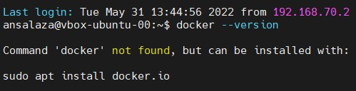
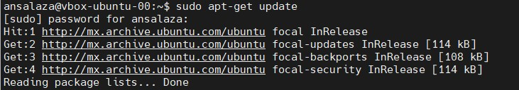
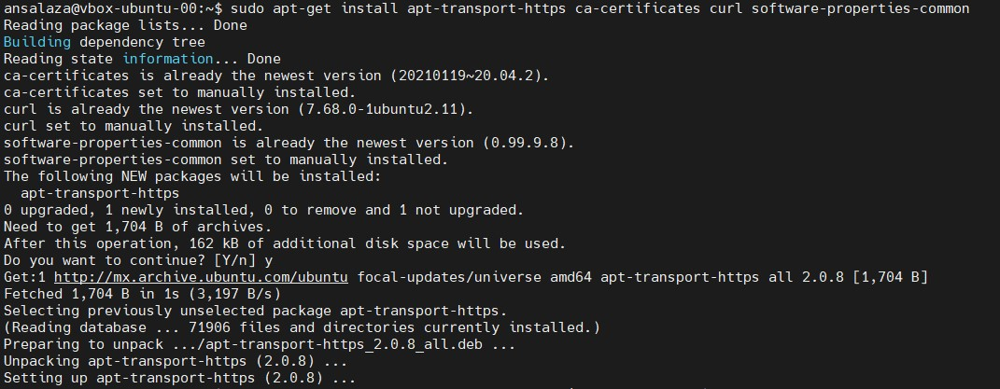
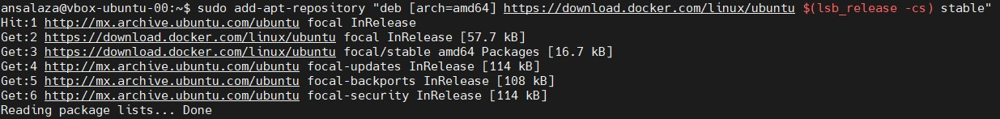
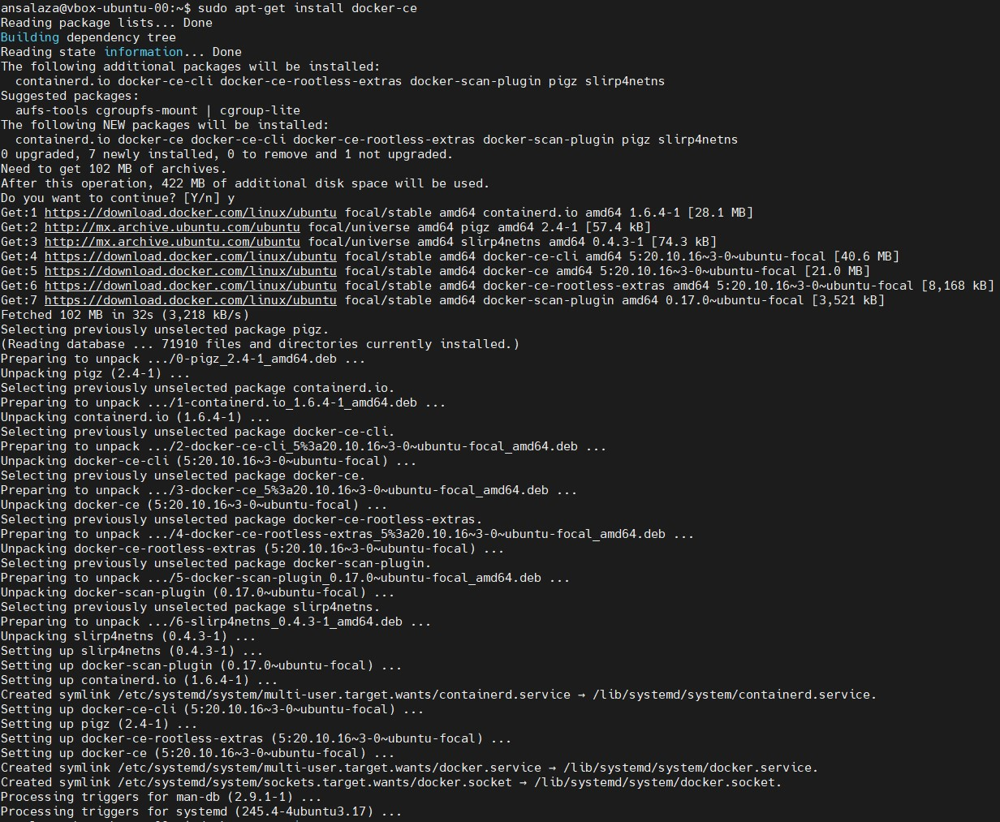
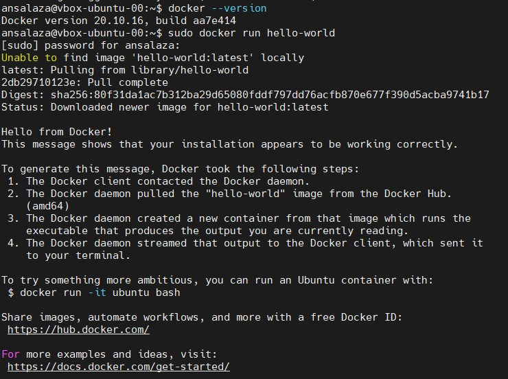
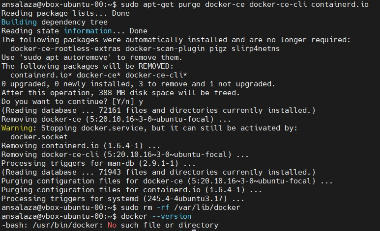

[dca.000.ins](dca.000.ins.md)

# Install Docker CE for Linux

- **Author**: Antonio Salazar
-  Gomez ([antonio.salazar@ymail.com](mailto:antonio.salazar@ymail.com))
- **Updated on**:  2022-06-05 
- **GitHub repository**: [kb_devops](https://github.com/gitansalaza/kb_devops)

# Description
**Objective**: Istall Docker CE on a Linux host.

**Tools required**: Docker CE

Steps to be followed:
1. Install Docker CE from the Docker repository.
2. Verify the correctly installed Docker engine.
3. Uninstall Docker CE using the purge command.

<br/>

# Solution
## 1. Install Docker CE from the Docker repository.

- Verify docker exists.

>```
> docker --version
>```



- Update the apt package list.

>```
> sudo apt-get update
>```



- Install the packages that allow apt to use a respository over HTTPS.

>```
> sudo apt-get install apt-transport-https ca-certificates curl software-properties-common
>```



- Add Docker's official GPG key.

>```
> curl -fsSL https://download.docker.com/linux/ubuntu/gpg | sudo apt-key add -
>```


- Set up a stable respository.

>```
> sudo add-apt-repository "deb [arch=amd64] https://download.docker.com/linux/ubuntu $(lsb_release -cs) stable"
>```



- Install the latest version of Docker CE.

>```
> sudo apt-get install docker-ce
>```




## 2. Verify the correctly installed Docker engine.

>```
> docker --version
> sudo docker run hello-world
>```



## 3. Uninstall Docker CE using the purge command.

- Short version.

>```
> sudo apt-get purge docker-ce docker-ce-cli container.io
> sudo rm -rf /var/lib/docker
>```



- Full uninstall and purge process
- Step 0: Disable docker services
>```
> sudo systemctl | grep -i docker
> sudo systemctl status <docker service>
> sudo systemctl stop <docker service>
> sudo systemctl disable <docker service>
>```


- Step 1: List the installed Docker packages

>```
> dpkg -l | grep -i docker
> #or 
> sudo dpkg-query -l | grep -i docker | awk '{print $2}'
>
> list=();
> for package in $(sudo dpkg-query -l | grep -i docker | awk '{print $2}'); do
>   list+=($package);
> done
> echo ${list[@]};
>```


- Step 2: Uninstall Docker packages

>```
> sudo apt-get purge ${list[@]};
> sudo apt-get autoremove ${list[@]};
>```

- Step3: Delete all images, containers, and volumes run the following commands:

>```
> sudo rm -rf /var/lib/docker /etc/docker /var/run/docker.sock;
> [ -d /etc/apparmor.d/docker ] && sudo rm /etc/apparmor.d/docker ;
> sudo groupdel docker
>```

- Step 4: cleanup the package list variable

>```
> unset list;
> echo ${list[@]};
>```

You have removed Docker from the system completely.

# Log file
[dca.000.ins.docker_installation.txt](logs/dca.000.ins.docker_installation.txt) 
