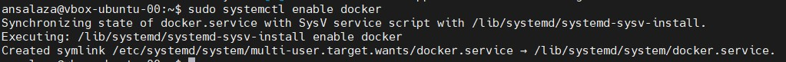
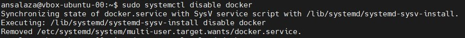
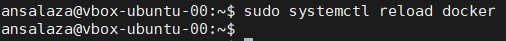
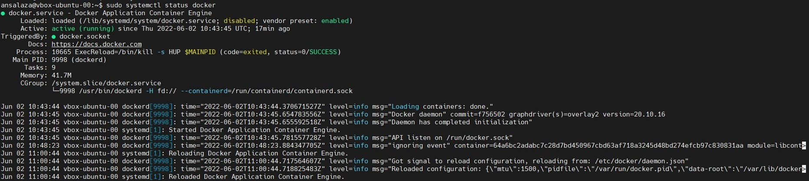
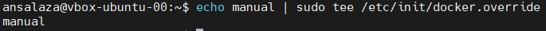
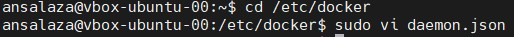
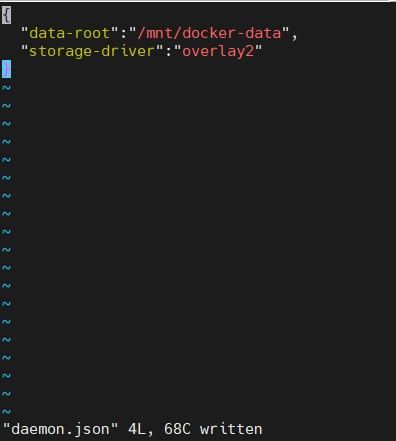

[dca.001.cfg](dca.001.cfg.md)

# Configure Docker Daemon to Start on Boot

- **Author**: Antonio Salazar
-  Gomez ([antonio.salazar@ymail.com](mailto:antonio.salazar@ymail.com))
- **Updated on**:  2022-06-05 
- **GitHub repository**: [kb_devops](https://github.com/gitansalaza/kb_devops)

# Description
**Objective**: Configure Docker Daemon to start on the system boot

**Tools required**: Docker CE

Steps to be followed:
1. Start the docker service, using systemctl commands for Ubuntu 16.04 and above.
2. Start and configure docker service using upstart command for Ubuntu 14.10 and below versions.
3. Create a daemon.json configuration file to configure the Daemon flags and environment variables.

<br/>

# Solution
## 1. Start the docker service, using systemctl commands for Ubuntu 16.04 and above

- Enable the Docker Daemon on the boot.

>```
> sudo systemctl enable docker
>```



- To disable the Docker Daemon from the boot use the command below.

>```
> sudo systemctl disable docker
>```



- Use the command below to reload the Docker Daemon.

>```
> sudo systemctl reload docker
>```



- Use the command below to check the Docker Daemon status.

>```
> sudo systemctl status docker
>```



## 2. Start and configure docker service using upstart command for Ubuntu 14.10 and below versions

- Use the command below to disable Docker start on the system boot:

>```
> echo manual | sudo tee /etc/init/docker.override
>```



## 3. Create a daemon.json configuration file to configure the Daemon flags and environment variables

- Change to `/etc/docker/` directory.

>```
> cd /etc/docker/
>```

- Create a new _daemon.json_ file.
 
>```
> sudo vi daemon.json
>```



- Set the following flags to control the disk space for Docker images and containers:

>```
> {
> "data-root": "/mnt/docker-data",
> "storage-driver": "overlay2"
> }
>```



**Note**: After writing the above code in the _daemon.json_ file, press the ESC button and
type :wq to save the file and exit the editor.

# Log file
[dca.001.cfg.docker_config.txt](logs/dca.001.cfg.docker_config.txt) 
